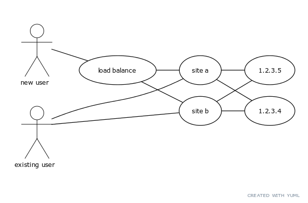

This is an example of a GTM domain where we have two datacentres and three endpoints.
This is intended for use by delivery Properties to choose their origin. It's an example
of a load balanced failover pair of origin endpoints in a fully meshed configuration.

The first endpoint is a load balance configuration which will maintain 50/50 load balancer
across two datacentre endpoints. This load balance will not use liveness test objects and
will return a CNAME. The intended use for this endpoint is for users who visit your site that
do not present a datacentre sticky cookie. You should use the hostname of this endpoint in
your Origin Behaviour. Once the origin is visited, the origin should set a sticky cookie
e.g. "origin=site1". When the next request comes from the browser, logic in the Property
should choose an Origin Behaviour for either lb-1 or lb-2 in order to keep the session
peristent for that user. Each of lb-1 and lb-2 are defined as primary/failover GTM
configurations. The intent of this is that if primary should fail, then the secondary IP
address will be served instead. The "origin" sticky cookie will persist the end users
session to this origin (the failover) for the duration of their session even if the primary
comes back up.



## Providers

| Name | Version |
|------|---------|
| <a name="provider_akamai"></a> [akamai](#provider\_akamai) | >= 6.0.0 |

## Inputs

| Name | Description | Type | Default | Required |
|------|-------------|------|---------|:--------:|
| <a name="input_config_section"></a> [config\_section](#input\_config\_section) | n/a | `string` | `"default"` | no |
| <a name="input_contractid"></a> [contractid](#input\_contractid) | Value unknown at the time of import. Please update. | `string` | `""` | no |
| <a name="input_edgerc_path"></a> [edgerc\_path](#input\_edgerc\_path) | n/a | `string` | `"~/.edgerc"` | no |
| <a name="input_groupid"></a> [groupid](#input\_groupid) | Value unknown at the time of import. Please update. | `string` | `""` | no |

## Outputs

No outputs.

<!-- BEGIN_TF_DOCS -->

# GTM Module

This is an example of a GTM domain where we have two datacenters and three endpoints.
This is intended for use by delivery Properties to choose their origin. It's an example
of a load balanced failover pair of origin endpoints in a fully meshed configuration.

The first endpoint is a load balance configuration which will maintain 50/50 load balancer
across two datacenter endpoints. This load balance will not use liveness test objects and
will return a CNAME. The intended use for this endpoint is for users who visit your site that
do not present a datacenter sticky cookie. You should use the hostname of this endpoint in
your Origin Behaviour. Once the origin is visited, the origin should set a sticky cookie
e.g. "origin=site1". When the next request comes from the browser, logic in the Property
should choose an Origin Behaviour for either lb-1 or lb-2 in order to keep the session
persistent for that user. Each of lb-1 and lb-2 are defined as primary/failover GTM
configurations. The intent of this is that if primary should fail, then the secondary IP
address will be served instead. The "origin" sticky cookie will persist the end users
session to this origin (the failover) for the duration of their session even if the primary
comes back up.

# Usage
Basic usage of this module is as follows:

```hcl
module "example" {
  	 source  = "<module-location>"
  
	 # Required variables
  	 akamai_access_token  = <string>
  	 akamai_client_secret  = <string>
  	 akamai_client_token  = <string>
  	 akamai_host  = <string>
  
	 # Optional variables
  	 akamai_account_key  = <string> | default: ""
  	 contractid  = <string> | default: ""
  	 groupid  = <string> | default: ""
}
 ```

## Requirements

| Name | Version |
|------|---------|
| <a name="requirement_terraform"></a> [terraform](#requirement\_terraform) | >= 1.9.0 |
| <a name="requirement_akamai"></a> [akamai](#requirement\_akamai) | ~> 7.0 |

## Resources

| Name | Type |
|------|------|
| [akamai_gtm_datacenter.Dublin](https://registry.terraform.io/providers/akamai/akamai/latest/docs/resources/gtm_datacenter) | resource |
| [akamai_gtm_datacenter.Frankfurt](https://registry.terraform.io/providers/akamai/akamai/latest/docs/resources/gtm_datacenter) | resource |
| [akamai_gtm_domain.example_co_uk](https://registry.terraform.io/providers/akamai/akamai/latest/docs/resources/gtm_domain) | resource |
| [akamai_gtm_property.lb](https://registry.terraform.io/providers/akamai/akamai/latest/docs/resources/gtm_property) | resource |
| [akamai_gtm_property.lb-1](https://registry.terraform.io/providers/akamai/akamai/latest/docs/resources/gtm_property) | resource |
| [akamai_gtm_property.lb-2](https://registry.terraform.io/providers/akamai/akamai/latest/docs/resources/gtm_property) | resource |

## Modules

No modules.

## Inputs

| Name | Description | Type | Default | Required |
|------|-------------|------|---------|:--------:|
| <a name="input_akamai_access_token"></a> [akamai\_access\_token](#input\_akamai\_access\_token) | Akamai access token | `string` | n/a | yes |
| <a name="input_akamai_client_secret"></a> [akamai\_client\_secret](#input\_akamai\_client\_secret) | Akamai client secret | `string` | n/a | yes |
| <a name="input_akamai_client_token"></a> [akamai\_client\_token](#input\_akamai\_client\_token) | Akamai client token | `string` | n/a | yes |
| <a name="input_akamai_host"></a> [akamai\_host](#input\_akamai\_host) | Akamai host | `string` | n/a | yes |
| <a name="input_akamai_account_key"></a> [akamai\_account\_key](#input\_akamai\_account\_key) | Akamai account key (optional) | `string` | `""` | no |
| <a name="input_contractid"></a> [contractid](#input\_contractid) | Value unknown at the time of import. Please update. | `string` | `""` | no |
| <a name="input_groupid"></a> [groupid](#input\_groupid) | Value unknown at the time of import. Please update. | `string` | `""` | no |

## Outputs

No outputs.

## Resources
- [Akamai API Credentials](https://techdocs.akamai.com/developer/docs/set-up-authentication-credentials)
- [Akamai Terraform Provider](https://techdocs.akamai.com/terraform/docs)
- [Akamai CLI for Terraform](https://github.com/akamai/cli-terraform)
- [Linode Object Storage](https://www.linode.com/lp/object-storage/)
- [Akamai Developer Youtube Channel](https://www.youtube.com/c/AkamaiDeveloper)
- [Akamai Github](https://github.com/akamai)
<!-- END_TF_DOCS -->